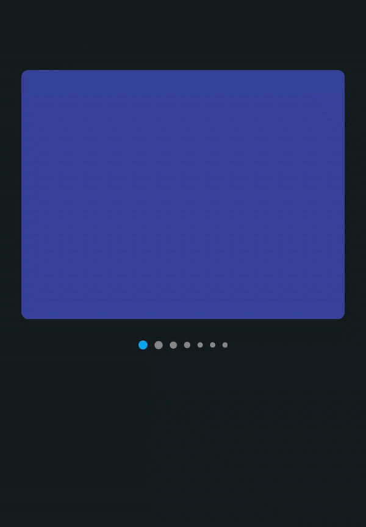

## Compose Custom Draggable Indicators

Demo project to create Instagram-like draggable indicators for Image carousel with diminishing effect.

> This is not a library. This is a demo project to experiment and try out a functionality.

### Blog post
The blog post explaining the source code can be found here:

[Create Instagram-like Long Press and Draggable Carousel Indicators in Jetpack Compose](https://blog.pushpalroy.com/create-instagram-like-long-press-and-draggable-carousel-indicators-in-jetpack-compose)

The blog is also available on Medium [here](https://medium.com/@pushpalroy2007/create-instagram-like-long-press-and-draggable-carousel-indicators-in-jetpack-compose-ce16fa75bc1e).


### Demo

<table style="width:100%">
  <tr>
    <th>Custom Draggable Indicator</th>
  </tr>
  <tr>
    <td></td>
  </tr>
</table>

### Features
- Instagram like long press and draggable indicators
- Indicators diminish in size for pages further away from the current selection, providing a focused visual effect

### Find this project useful?

- Support it by clicking the ⭐️ button on the upper right of this page.

### License

```
MIT License

Copyright (c) 2024 Pushpal Roy

Permission is hereby granted, free of charge, to any person obtaining a 
copy of this software and associated documentation files (the "Software"), 
to deal in the Software without restriction, including without limitation 
the rights to use, copy, modify, merge, publish, distribute, sublicense, 
and/or sell copies of the Software, and to permit persons to whom the 
Software is furnished to do so, subject to the following conditions:

The above copyright notice and this permission notice shall be included 
in all copies or substantial portions of the Software.

THE SOFTWARE IS PROVIDED "AS IS", WITHOUT WARRANTY OF ANY KIND, EXPRESS OR 
IMPLIED, INCLUDING BUT NOT LIMITED TO THE WARRANTIES OF MERCHANTABILITY, 
FITNESS FOR A PARTICULAR PURPOSE AND NONINFRINGEMENT. IN NO EVENT SHALL THE 
AUTHORS OR COPYRIGHT HOLDERS BE LIABLE FOR ANY CLAIM, DAMAGES OR OTHER LIABILITY, 
WHETHER IN AN ACTION OF CONTRACT, TORT OR OTHERWISE, ARISING FROM, OUT OF OR IN 
CONNECTION WITH THE SOFTWARE OR THE USE OR OTHER DEALINGS IN THE SOFTWARE.
```
